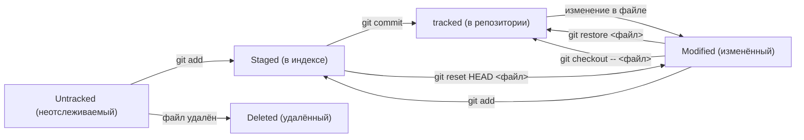

# 📝 Шпаргалка Git & GitHub

## 🔹 Настройка

``` bash
git config --global user.name "Твоё Имя"  # Установить имя 
git config --global user.email "email@example.com" # Установить emai
git config --list   # Проверить настройки
```

## 🔹 Создание и инициализация

``` bash
git init                 # Инициализация репозитория в текущей папке
git clone <url>          # Клонирование репозитория
```

## 🔹 Основные операции

``` bash
git status               # Проверить состояние репозитория
git add <файл>           # Добавить файл в индекс (staging)
git add --all                # Добавить все изменения
git commit -m "сообщение" # Зафиксировать изменения
git log                  # История коммитов
git log --oneline        # Получить сокращённый лог
git diff                 # Посмотреть изменения
```

## 🔹 Работа с ветками

``` bash
git branch               # Список веток
git branch <имя>         # Создать новую ветку
git checkout <ветка>     # Переключиться на ветку
git checkout -b <ветка>  # Создать и перейти
git merge <ветка>        # Слить ветку в текущую
git branch -d <ветка>    # Удалить ветку (локально)
```

## 🔹 Работа с удалённым репо (GitHub)

``` bash
git remote add origin <url>  # Привязать удалённый репозиторий
git remote -v                # Проверить привязку

git push -u origin main (master)      # Первый пуш ветки main также она может быть веткой master
git push                     # Отправить изменения
git pull                     # Получить изменения
git fetch                    # Скачать изменения без слияния
```

## 🔹 Отмена изменений

``` bash
git restore <файл>           # Вернуть файл из последнего коммита
git reset HEAD <файл>        # Убрать файл из staging
git reset --hard HEAD        # Откатить все изменения
```

## 🔹 Работа с тегами

``` bash
git tag v1.0                   # Создать тег
git tag                        # Список тегов
git push origin v1.0           # Отправить тег
```

## 🔹 Полезное

``` bash
git stash                      # Сохранить незакоммиченные изменения
git stash pop                  # Вернуть изменения из stash
git reflog                     # История всех действий
```

------------------------------------------------------------------------

# 🚀 Мини-сценарий (GitHub Flow)

1.  **Клонировать проект**

    ``` bash
    git clone <url>
    cd project
    ```

2.  **Создать ветку для задачи**

    ``` bash
    git checkout -b feature-branch
    ```

3.  **Внести изменения и закоммитить**

    ``` bash
    git add .
    git commit -m "Добавил новую фичу"
    ```

4.  **Отправить в GitHub**

    ``` bash
    git push -u origin feature-branch
    ```

5.  **Создать Pull Request** (через GitHub UI).

------------------------------------------------------------------------

# 🔹 Управление выводом в Git Bash (`less`)

Когда ты вводишь команды вроде `git log`, `git diff` или `git show`, Git
открывает вывод через встроенный **пейджер** (`less`).
Внизу может отображаться `:`, `(END)` или `--More--`. Вот как управлять:

### 📜 Навигация

-   **Пробел** --- пролистать вниз на экран
-   **Enter / ↓** --- пролистать на одну строку вниз
-   **↑** --- пролистать на одну строку вверх
-   **b** --- пролистать назад на экран
-   **d** --- пролистать вниз на полэкрана
-   **u** --- пролистать вверх на полэкрана

### 🔎 Поиск

-   **/** *текст* --- найти текст вперёд
-   **?** *текст* --- найти текст назад
-   **n** --- повторить поиск в том же направлении
-   **N** --- повторить поиск в обратном направлении

### 🛑 Выход

-   **q** --- выйти из просмотра (вернуться в консоль)

------------------------------------------------------------------------

# 🔹 Дополнительно о Git

### 🧩 Хеш коммита

-   **Хеширование** (от англ. hash, «рубить», «крошить», «мешанина») — это способ преобразовать набор данных и получить их «отпечаток» (англ. fingerprint).
-   **Хеш** — основной идентификатор коммита, он позволяет узнать его автора, дату и содержимое закоммиченных файлов. Каждый коммит получает уникальный **SHA-1 хеш** (например:
    `a1b2c3d4...`).
-   Используется для ссылки на коммит в историях, откатах,
    `git checkout` и т.п.

### 📜 Лог

-   `git log` — список всех коммитов с автором, датой и сообщением.
-   `git log --oneline` — краткая форма (хеш + сообщение).
-   `git log --graph --oneline --decorate --all` — наглядный граф
    веток.

### 🎯 HEAD

-   `HEAD` —  один из служебных файлов папки .git. Он указывает на коммит, который сделан последним (т.е. на самый новый).
-   Когда вы делаете коммит, Git обновляет `refs/heads/master` — записывает в него хеш последнего коммита. Получается, что HEAD тоже обновляется, так как ссылается на `refs/heads/master`.
-   Если переключиться (`git checkout`), `HEAD` указывает туда.

### 📂 Статусы файлов

-   **untracked** — новый файл, Git его не отслеживает
-   **modified** — файл изменён, но не добавлен в индекс (не выполнена `git add`)
-   **staged** — файл добавлен в индекс (выполнена `git add`)
-   **tracked** — изменения сохранены в истории (выполнен коммит), этот статус `git status` не отображает. **modified** и **staged** файлы как правило **tracked**

#### 📊 Схема жизненного цикла файлов



### ✍️ Оформление сообщений к коммитам

-   Сообщение должно быть понятным, коротким и информативным
-   Стиль оформления будет зависеть от принятых в компании правил 
-   Важно единообразие коммитов, т.к. так их проще будет воспринимать 
-   Есть несколько популярных подходов к оформлению: Корпоративный (с интеграцией Jira), Conventional Commits (формат коммита — **<type>: <сообщение>**, где <type> — feat (feature) или fix) и GitHub-стиль

------------------------------------------------------------------------
